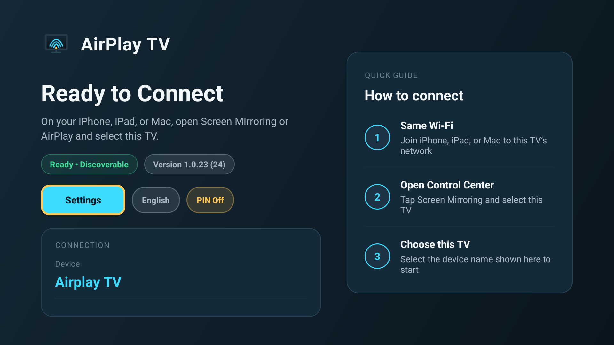
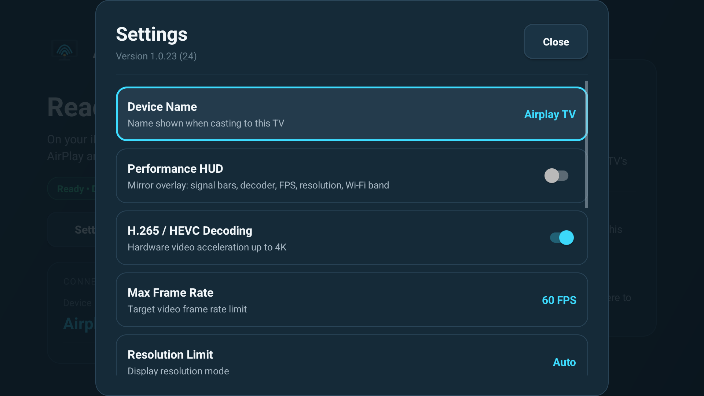
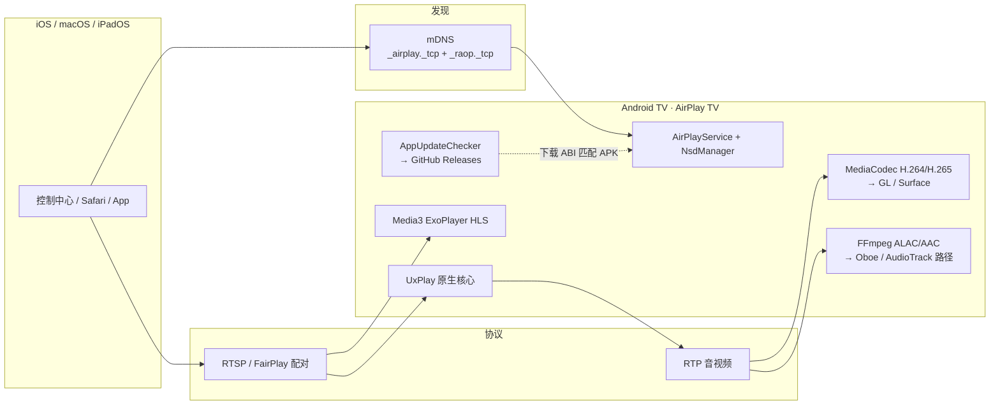
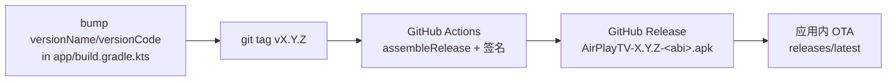
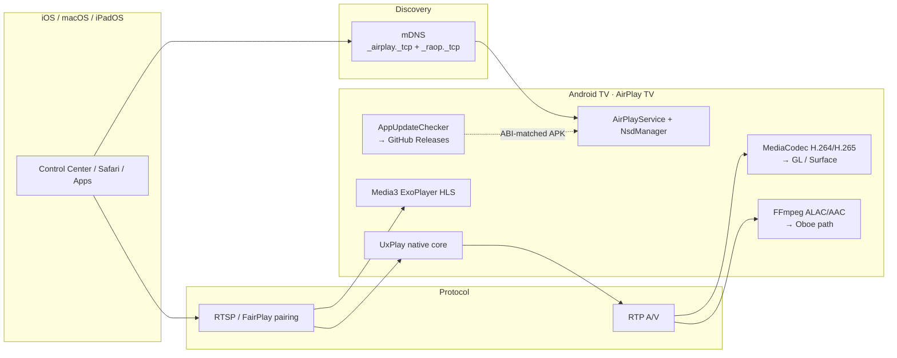
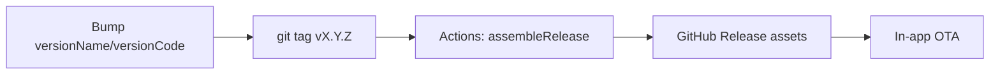

<div align="center">
  
  <h1>AirPlay TV</h1>
  <p><strong>开源高性能 AirPlay 接收端 · Android TV / Google TV</strong><br />
  <em>Open-source high-performance AirPlay receiver for Android TV &amp; Google TV</em></p>

  <p>
    <a href="https://www.gnu.org/licenses/gpl-3.0"></a>
    <a href="https://developer.android.com/tv"></a>
    <a href="https://developer.android.com/ndk"></a>
    <a href="https://github.com/zinw/airplay-tv/releases"></a>
  </p>

  <p><a href="#-中文">中文</a> · <a href="#-english">English</a> · <a href="README.en.md">English only</a></p>
</div>

<p align="center">
  
</p>

---

# 中文

基于 [UxPlay](https://github.com/FDH2/UxPlay) 原生 RTSP/RAOP 核心的 Android TV AirPlay 接收端：屏幕镜像（H.264/H.265 + 同步音频）、HLS/网页视频投屏，以及面向遥控器的 10 英尺 Leanback UI。仓库已独立于原 [flymop/airplay-tv](https://github.com/flymop/airplay-tv) 维护。

## 功能

- **屏幕镜像**：实时 1080p60 / 4K，MediaCodec 硬解 H.264、HEVC（可开关），镜像音频经 Oboe 低延迟输出。
- **HLS / 网页视频**：Safari、Bilibili、YouTube（经 FCUP）直链播放，OSD 进度与遥控器控制。
- **Android TV 体验**：D-Pad 导航、设置热更新、可选 PIN 配对、开机自启、性能 HUD。
- **应用内 OTA**：查询 GitHub Releases，按设备 ABI 下载 APK（含国内镜像回退）。
- **16KB 页大小**：适配较新 Android 设备内存页对齐要求。

> 不提供独立「仅音频 / 音乐 Now Playing」界面；`_raop._tcp` 与音频能力位仍会广播，因为**屏幕镜像同步音频**依赖它们。

## 支持设备

在 **荣耀智慧屏 X1（LOK-350）** 等真机上验证；推荐安装 **arm64-v8a** APK。亦提供 `armeabi-v7a`、`x86_64`、universal。最低 Android TV 8.0（API 26）。

## 截图

| 主界面（空闲） | 设置 |
| :---: | :---: |
|  |  |

屏幕镜像实拍可由维护者后续放入 `docs/screenshots/screen_mirroring_photo.jpg`（此处不挂失效链接）。

## 架构



## 安装与升级

1. 从 [Releases](https://github.com/zinw/airplay-tv/releases) 下载 APK（优先 `AirPlayTV-<version>-arm64-v8a.apk`）。
2. 侧载安装，例如：

```bash
adb install -r AirPlayTV-1.0.24-arm64-v8a.apk
```

3. **1.0.4 及以后**使用同一上传证书，可直接覆盖升级。若仍在 **1.0.1–1.0.3**，需先卸载再装新版。

应用内更新：冷启动检查 `releases/latest`，确认后下载；网络受限时依次尝试 GitHub → ghproxy → ghfast。

## 使用

1. 电视与 Apple 设备同一 Wi‑Fi（关闭 AP 隔离，允许组播/mDNS）。
2. 打开 AirPlay TV，保持就绪界面或前台服务运行。
3. 控制中心 → **屏幕镜像** → 选择本机名称（画面 + 同步声音）。
4. 网页视频：Safari / 支持 AirPlay 的 App 内点 AirPlay 图标。
5. 可选：主界面开启 PIN 配对。

遥控器：镜像中 **返回** 断开；**确认** 播放/暂停；**信息/蓝键** 切换 HUD。HLS：左右快进退，上下显示控制条。

更多说明见 [用户指南](docs/USER_GUIDE.md)。

## 从源码构建

```bash
git clone --recursive https://github.com/zinw/airplay-tv.git
cd airplay-tv
./gradlew assembleRelease
```

产物在 `app/build/outputs/apk/release/`（按 ABI 拆分 + universal）。调试与 release 均使用仓库内 `keystore/airplaytv-upload.keystore`（见 `keystore/README.md`），以保持与 1.0.4+ 相同的签名、支持覆盖安装。

**请勿修改** `applicationId`（`com.flymop.airplaytv`）或应用显示名，否则无法覆盖已安装版本。

工具链：JDK 17、NDK `27.0.12077973`、CMake `3.22.1`、compileSdk 34。详见 [构建与调试](docs/building_and_debugging.md)。

## 发布新版本（仅打 tag）

`versionName` / `versionCode` 以 `app/build.gradle.kts` 为准；**tag 必须与 versionName 一致**，否则 CI 失败。

```bash
# 1. 编辑 app/build.gradle.kts：提高 versionCode，设置 versionName（如 "1.0.24"）
# 2. 提交并推送到 main
git add app/build.gradle.kts && git commit -m "chore: bump to 1.0.24" && git push origin main

# 3. 打 tag 并推送（不要本地打 APK）
git tag v1.0.24
git push origin v1.0.24
```

GitHub Actions（[`.github/workflows/release.yml`](.github/workflows/release.yml)）会：校验 `v1.0.24` == `versionName`、签名构建、发布 Release，资源名为 `AirPlayTV-1.0.24-arm64-v8a.apk` 等，正文含 `versionCode: N` 与 SHA-256（供应用内 OTA）。

干跑（只构建、上传 workflow artifact，不发 Release）：

```bash
gh workflow run release.yml --ref <your-branch>
```



## 致谢与许可

- 原项目 [flymop/airplay-tv](https://github.com/flymop/airplay-tv)
- [FDH2/UxPlay](https://github.com/FDH2/UxPlay)、[jqssun/android-airplay-server](https://github.com/jqssun/android-airplay-server)
- [google/oboe](https://github.com/google/oboe)、[FFmpeg](https://ffmpeg.org)、[libplist](https://github.com/libimobiledevice/libplist)

**GNU GPL-3.0** — 见 [LICENSE](LICENSE)。

技术文档：[架构](docs/architecture.md) · [视频管线](docs/video_pipeline.md) · [音频管线](docs/audio_pipeline.md) · [HLS/网络](docs/hls_and_network.md) · [TV UI](docs/tv_ui_and_remote.md) · [对比](docs/COMPARISON.md) · [PROMPT](docs/PROMPT.md)

---

# English

Open-source AirPlay receiver for **Android TV / Google TV**, built on a native [UxPlay](https://github.com/FDH2/UxPlay) RTSP/RAOP core: screen mirroring (H.264/H.265 + synced audio), HLS/web video casting, and a D-pad Leanback UI. This repo is maintained independently of the original [flymop/airplay-tv](https://github.com/flymop/airplay-tv).

For a standalone English copy, see [README.en.md](README.en.md).

## Features

- **Screen mirroring** — 1080p60 / 4K, MediaCodec H.264 & optional HEVC, low-latency mirror audio via Oboe.
- **HLS / web video** — Safari, Bilibili, YouTube (FCUP) with OSD and remote controls.
- **Android TV UX** — D-pad navigation, hot-reload settings, optional PIN, start on boot, performance HUD.
- **In-app OTA** — GitHub Releases + ABI selection (+ mirror fallbacks).
- **16KB page-size** ready.

No dedicated audio-only / music Now Playing UI. `_raop._tcp` and audio feature bits stay advertised because **mirror synced audio** needs them.

## Supported devices

Tested on **Honor Smart Screen X1 (LOK-350)**; prefer the **arm64-v8a** APK. Also ships `armeabi-v7a`, `x86_64`, and universal. Min Android TV 8.0 (API 26).

## Screenshots

| Idle home | Settings |
| :---: | :---: |
|  |  |

A real mirroring photo can be added later as `docs/screenshots/screen_mirroring_photo.jpg` (no broken image link here).

## Architecture



## Install & upgrade

1. Download from [Releases](https://github.com/zinw/airplay-tv/releases) (prefer `AirPlayTV-<version>-arm64-v8a.apk`).
2. Sideload, e.g. `adb install -r AirPlayTV-1.0.24-arm64-v8a.apk`.
3. **1.0.4+** shares one upload cert — overlay OK. From **1.0.1–1.0.3**, uninstall once first.

In-app OTA checks `releases/latest` and picks the device ABI (then universal). Asset names must contain the ABI or `universal` (see `AppUpdateChecker`).

## Usage

Same Wi‑Fi, launch the app, Control Center → **Screen Mirroring**. Optional PIN from the home chip. See [USER_GUIDE.md](docs/USER_GUIDE.md).

## Build from source

```bash
git clone --recursive https://github.com/zinw/airplay-tv.git
cd airplay-tv
./gradlew assembleRelease
```

Do **not** change `applicationId` (`com.flymop.airplaytv`) or the app name. Signing: committed `keystore/` (same cert as 1.0.4+). Toolchain notes: [building_and_debugging.md](docs/building_and_debugging.md).

## Cutting a release (tag only)

`app/build.gradle.kts` is the source of truth for `versionName` / `versionCode`. The tag **must** match `versionName` or CI fails.

```bash
# Bump versionCode + versionName, commit to main, then:
git tag v1.0.24
git push origin v1.0.24
```

Workflow: [`.github/workflows/release.yml`](.github/workflows/release.yml). Dry-run: `gh workflow run release.yml --ref <branch>` (artifacts only, no Release).



## Credits & license

Originally based on [flymop/airplay-tv](https://github.com/flymop/airplay-tv); [UxPlay](https://github.com/FDH2/UxPlay), [android-airplay-server](https://github.com/jqssun/android-airplay-server), Oboe, FFmpeg, libplist. **GPL-3.0** — [LICENSE](LICENSE).
