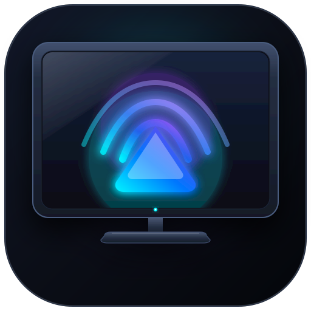
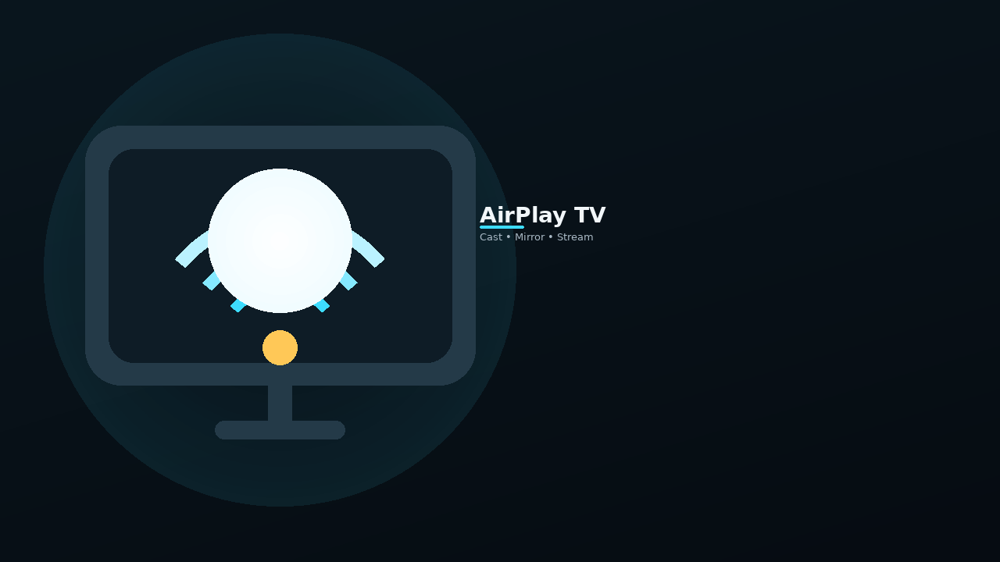
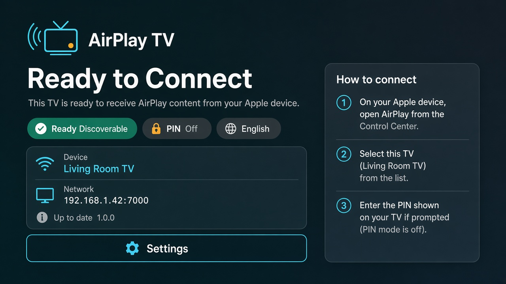
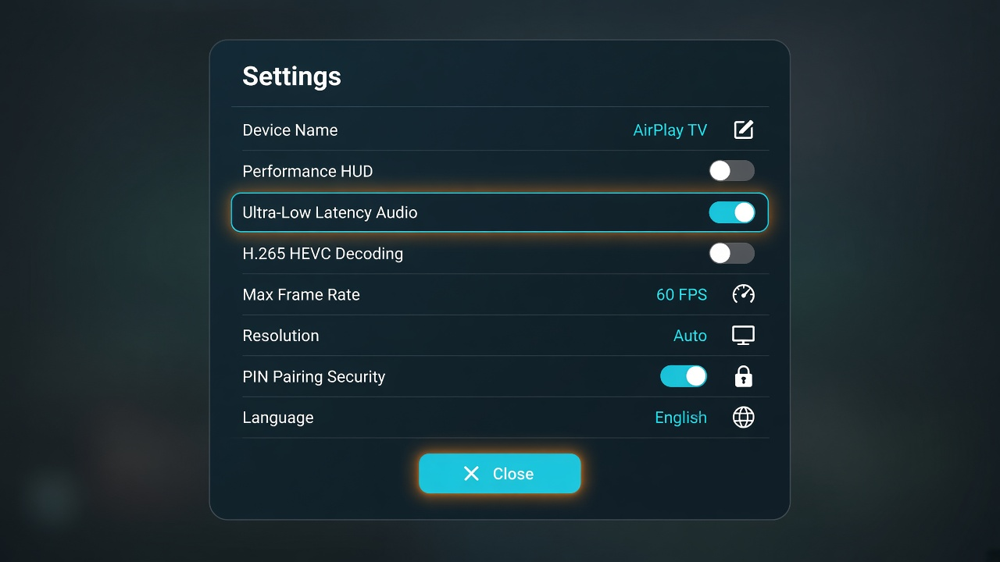
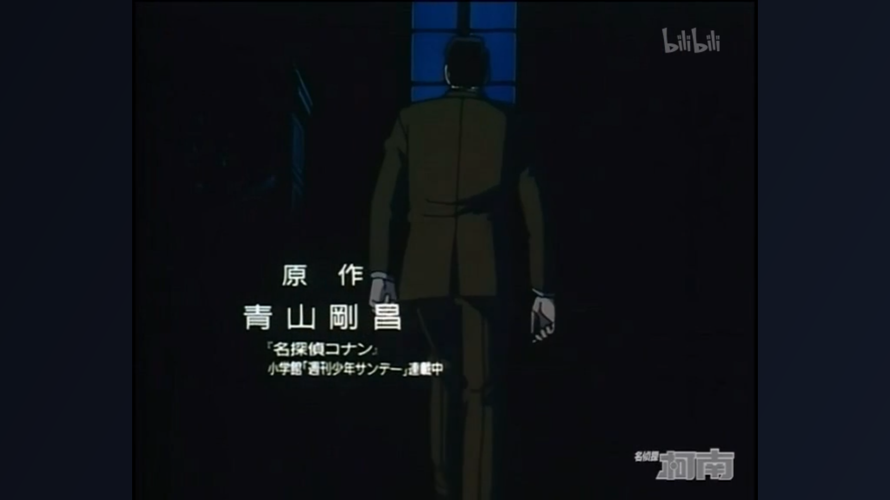

<div align="center">
  
  <h1>AirPlay TV</h1>
  <p><strong>High-performance, open-source AirPlay receiver tailored specifically for Android TV &amp; Google TV.</strong></p>

  <p>
    <a href="https://www.gnu.org/licenses/gpl-3.0"></a>
    <a href="https://developer.android.com/tv"></a>
    <a href="https://developer.android.com/ndk"></a>
    <a href="https://github.com/flymop/airplay-tv/releases"></a>
  </p>
</div>

<br />

<p align="center">
  
</p>

An open-source, high-performance AirPlay receiver tailored specifically for **Android TV** and Google TV devices. Built on top of a native C/C++ RTSP/RAOP core with Google Oboe and hardware-accelerated MediaCodec video pipelines.

---

## 📸 Screenshots

| Ambient Home Screen | TV Settings Modal |
| :---: | :---: |
|  |  |
| *Ready to connect with D-pad focusable Settings / language / PIN* | *D-Pad navigable settings with hot-reload* |

| Screen Mirroring | HLS Web Video Player |
| :---: | :---: |
|  |  |
| *Low-latency 1080p60/4K screen mirroring with synced audio* | *HLS/MP4 video with full OSD timeline controls* |

---

## 📖 Background

While Apple AirPlay provides seamless screen mirroring and media casting across Apple ecosystems, official AirPlay receiver support on Android TV devices is rare or locked behind proprietary paid apps. 

**AirPlay TV** bridges this gap by combining the native protocol capabilities of [UxPlay](https://github.com/FDH2/UxPlay) with Android TV optimizations derived from [android-airplay-server](https://github.com/jqssun/android-airplay-server). It delivers an intuitive 10-foot Leanback experience, hardware-accelerated video rendering, and zero-JNI low-latency audio output.

---

## ✨ Features

- **🚀 Dual-Mode AirPlay Support**:
  - **Screen Mirroring**: Real-time 1080p60 & 4K mirroring with H.264 / HEVC hardware acceleration and synced mirror audio.
  - **Direct HLS Web Video**: Direct URL streaming for Safari, Bilibili, and YouTube (via FCUP reverse proxy) with full timeline seeking and OSD.
  - Standalone / audio-only AirPlay (music speaker / `_raop._tcp`) is **not** advertised or accepted.
- **⚡ Ultra-Low Latency Audio**:
  - Powered by **Google Oboe** (native AAudio & OpenSL ES) bypassing Java AudioTrack overhead.
  - Native jitter buffer with adaptive drift compensation for Screen Mirroring audio.
- **🎮 Dedicated Android TV 10-Foot Experience**:
  - Full D-Pad remote control navigation without requiring touch or mouse pointers.
  - Apple TV-style interactive control flow during active mirroring and media playback.
- **⚙️ Dynamic TV Settings Overlay**:
  - On-the-fly resolution configuration (Auto, 4K, 1080p, 720p).
  - HEVC (H.265) hardware decoding toggle.
  - Configurable PIN code pairing and frame rate limits.
  - Instant server re-announcement on setting changes.
- **🛡️ 16KB Page-Size Ready**:
  - Built with modern Android 15+ 16KB memory page compatibility.

---

## 🏗️ Architecture Overview

AirPlay TV uses a hybrid C++/Kotlin architecture:

```
+-------------------------------------------------------------------------------+
|                       iOS / macOS / iPadOS Client                             |
|          (Control Center Screen Mirroring, Safari HLS, YouTube)         |
+-------------------------------------------------------------------------------+
                                       |
                     mDNS / RTSP / HTTP (Reverse PTTH) / RTP
                                       |
                                       v
+-------------------------------------------------------------------------------+
|                             Android TV App                                    |
|                                                                               |
|  +---------------------+   +---------------------+   +---------------------+  |
|  |  MainActivity (UI)  |   | AirPlayService (BG) |   | TV Settings Overlay |  |
|  |  - 10-ft Leanback   |   | - Foreground Service|   | - Dynamic Hot-Reload|  |
|  |  - D-Pad Navigator  |   | - Multicast/WakeLock|   | - StateFlow Binding |  |
|  |  - Live Status & HUD|   | - MediaSession DACP |   |                     |  |
|  +---------------------+   +---------------------+   +---------------------+  |
|                                       |                                       |
|                                  JNI Bridge                                   |
|                                       |                                       |
|  +---------------------+   +---------------------+   +---------------------+  |
|  | UxPlay RAOP Core    |   | Native Audio Engine |   | Android DNSSD Shim  |  |
|  | - RTSP / FairPlay   |   | - Google Oboe Engine|   | - NsdManager        |  |
|  | - Plist & FCUP      |   | - FFmpeg ALAC / AAC |   | - Conflict Handling |  |
|  | - 2MB Socket Buffer |   | - Timeline Jitter   |   |                     |  |
|  +---------------------+   +---------------------+   +---------------------+  |
|                                       |                                       |
|  +---------------------+   +---------------------+   +---------------------+  |
|  | Decoupled GL Render |   | MediaCodec (HW AVC) |   | Media3 ExoPlayer    |  |
|  | - Dedicated Thread  |   | MediaCodec (HW HEVC)|   | - HLS / MP4 Stream  |  |
|  | - VBO Quad Blit     |   | - Off-screen Surface|   | - Live OSD Controls |  |
|  +---------------------+   +---------------------+   +---------------------+  |
+-------------------------------------------------------------------------------+
```

For comprehensive technical deep dives, refer to the documentation in [`docs/`](docs/):
- [User Guide](docs/USER_GUIDE.md)
- [Competitor Comparison](docs/COMPARISON.md)
- [System Architecture](docs/architecture.md)
- [Building & Debugging Guide](docs/building_and_debugging.md)
- [Video Rendering Pipeline](docs/video_pipeline.md)
- [Low-Latency Audio Pipeline](docs/audio_pipeline.md)
- [HLS Video & Network Protocol](docs/hls_and_network.md)
- [Android TV UI & Remote Control UX](docs/tv_ui_and_remote.md)
- [AI Agent Context & System Prompt](docs/PROMPT.md)

---

## 🕹️ Remote Controller Guide

| Scenario | Remote Button | Action |
| :--- | :--- | :--- |
| **Ambient / Idle Screen** | D-Pad Navigation | Move focus across buttons and settings |
| | Center / OK | Open Settings or activate button |
| | Back | Exit application |
| **Settings Overlay** | D-Pad Up / Down | Navigate setting items |
| | Center / OK | Toggle switch or edit value |
| | Back | Close Settings and return to main screen |
| **Screen Mirroring** | Back | Instantly disconnect AirPlay session |
| | Center / OK | Send DACP Play / Pause to iOS |
| | Info / Blue Key | Toggle Performance HUD Overlay |
| **HLS Video Playback** | Left / Right | Seek -10s / +10s |
| | Up / Down | Show on-screen playback controller |
| | Center / OK | Toggle Play / Pause |
| | Back (Controls Visible) | Dismiss on-screen controller |
| | Back (Controls Hidden) | Stop video and return to main screen |

---

## 🚀 Getting Started & User Guide

### 1. Installation
Download the latest production release APK from [GitHub Releases](https://github.com/flymop/airplay-tv/releases) or install via ADB:
```bash
# Connect to your Android TV
adb connect <TV_IP_ADDRESS>

# Install the latest release APK
adb install -r AirPlayTV-<SHORT_HASH>-release.apk
```

### 2. Connecting from Apple Devices
1. Ensure your Android TV and Apple device (iPhone, iPad, Mac) are connected to the **same Wi-Fi network**.
2. Open **Control Center** on your iOS device:
   - **Screen Mirroring**: Tap **Screen Mirroring** $\rightarrow$ select **Airplay TV** (video + synced audio).
   - **Web / Online Video**: Tap the **AirPlay** icon inside Safari, YouTube, or Bilibili $\rightarrow$ select **Airplay TV**.
3. Pure audio-only AirPlay (Apple Music / Spotify speaker target) is **not** supported and is not advertised.
### 3. Adjusting Settings
On the Ambient screen, select the **SETTINGS** button using the remote's **OK / Center** button:
- **Device Name**: Customize the broadcast name displayed in Apple devices.
- **Performance HUD**: Toggle real-time overlay — top-right Wi‑Fi signal bars and bottom-right `decoder | rec/dec | WxH | band` line during mirror (persisted).
- **Ultra-Low Latency Audio** / **Audio stability**: Trade delay vs glitch resistance on the Oboe path.
- **H.265 / HEVC Decoding**: Enable/disable 4K HEVC hardware acceleration.
- **Max Frame Rate & Resolution**: Limit stream resolution or frame rate to optimize for low-power chipsets.
- **Overscan / Allow new connections / Start on boot**: TV receiver polish aligned with common competitor settings.

See the [User Guide](docs/USER_GUIDE.md) for install, troubleshooting, and the [competitor comparison](docs/COMPARISON.md).

---

## 🛠️ Building from Source

### Quick Build
```bash
# 1. Clone the repository with submodules
git clone --recursive https://github.com/flymop/airplay-tv.git
cd airplay-tv

# 2. Build Debug APK
./gradlew assembleDebug

# 3. Install on TV via ADB
adb connect <TV_IP_ADDRESS>:<PORT>
./gradlew installDebug
```

For full details on Wireless ADB setup, logcat filtering, Performance HUD diagnostics, and NDK toolchains, see the **[Building & Debugging Guide](docs/building_and_debugging.md)**.

---

## 📲 In-App Update Check (Self-Testing Builds)

On cold start the app queries the public GitHub Releases API for [`zinw/airplay-tv`](https://github.com/zinw/airplay-tv/releases/latest). If a newer build is found, a confirm dialog is shown; only after the user accepts does the app download the release APK and hand it to the system package installer. Offline / rate-limit failures are soft (logged, never crash or block the home screen).

Downloads try **GitHub first**, then public prefix mirrors with backoff (for flaky access from some regions, including China mainland):

1. `https://github.com/.../releases/download/...` (primary)
2. `https://ghproxy.net/https://github.com/.../releases/download/...`
3. `https://ghfast.top/https://github.com/.../releases/download/...`

(`mirror.ghproxy.com` was probed and is currently omitted.) Progress shows the active source; failures show a reason plus **Retry** / **Cancel**, and the APK is size-checked (GitHub asset size / Content-Length) plus ZIP magic before the installer is launched so truncated files do not surface as 「应用未安装」.

### How to publish a test release the updater can see

1. Bump `versionCode` and `versionName` in `app/build.gradle.kts`.
2. Build an APK, e.g. `./gradlew assembleDebug` or `./gradlew assembleRelease`
   (both use `keystore/airplaytv-upload.keystore` — see `keystore/README.md`).
3. Create a **non-draft** GitHub Release on `zinw/airplay-tv`:
   - **Tag** (required for name compare): `v{versionName}` such as `v1.0.4`.
   - **Preferred for versionCode compare**: put a line `versionCode: N` in the release body (same `N` as `app/build.gradle.kts`), **or** use tag metadata `v1.0.4+N`.
   - **Attach** a clearly named `.apk` asset, for example:
     - `AirPlayTV-1.0.4-universal.apk`, or
     - ABI-specific names containing `arm64-v8a`, `armeabi-v7a`, `x86_64`, or `universal` (the app prefers the device ABI, then universal).
4. Publish the release. Relaunch the installed older build on the TV; it should prompt once per process start.

**Signing / overlay:** From **1.0.4** onward, builds share one committed upload keystore, so OTA overlays work. Upgrading from **1.0.1–1.0.3** still needs one uninstall (those Releases each used a different ephemeral debug cert).

Version comparison order: body `versionCode` → tag `+versionCode` / numeric tag → SemVer `versionName` from the tag.

---

## 🤝 Acknowledgements & Credits

This project is built upon the incredible work of the open-source community:

- [**jqssun/android-airplay-server**](https://github.com/jqssun/android-airplay-server) — The original open-source AirPlay receiver for Android.
- [**FDH2/UxPlay**](https://github.com/FDH2/UxPlay) — The foundational open-source AirPlay server backend.
- [**google/oboe**](https://github.com/google/oboe) — High-performance real-time audio library for Android.
- [**FFmpeg**](https://ffmpeg.org) & [**libplist**](https://github.com/libimobiledevice/libplist) — Essential multimedia and Apple property list decoding libraries.

---

## 📄 License

This project is licensed under the **GNU General Public License v3.0 (GPLv3)**. See the [LICENSE](LICENSE) file for details.
